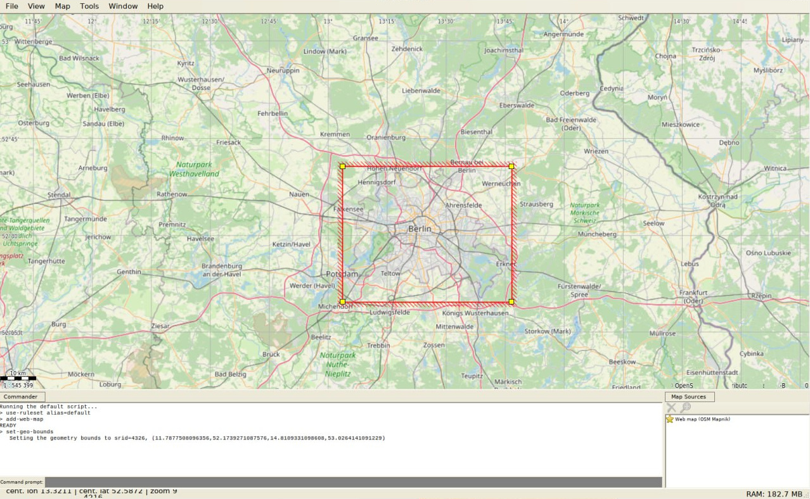

[](https://github.com/jgauchia/IceNav-v3/actions/) 


ESP32 Based GPS Navigator.

## Specifications

* ESP32 WROVER with 4Mb PSRAM / 16 Mb Flash
* ILI9488 TFT (320x480)
* SD/MicroSD reader
* HCM5883L Magnetometer
* BME280   Temperature / Humidity sensor
* MPU6050  Accelerometer and Gyroscope IMU
* HT1818Z3G5L GPS Module (AT6558D)
* LVGL UI + LovyanGFX


#

# Wiring

       Pinout (ESP32-WROVER)
       HCM5883L      BME280        MPU6050       ILI9488        SD CARD        VBAT             GPS
       -----------------------------------------------------------------------------------------------------
       VCC 3,3v      VCC 5v        VCC 3.3v      VCC  3,3v      VCC  3,3v      GPIO34           VCC  3,3v
       GND GND       GND GND       GND GND       GND  GND       GND  GND       ADC1_CHANNEL_6   GND  GND
       SDA GPIO21    SDA GPIO21    SDA GPIO21    LED  GPIO33    CS   GPIO4     (Resist. div)    RX   GPIO25
       SCL GPIO22    SCL GPIO22    SCL GPIO22    MISO GPIO27    MISO GPIO19                     TX   GPIO26
                                                 SCK  GPIO14    SCK  GPIO12
                                                 MOSI GPIO13    MOSI GPIO23
                                                 DC   GPIO15
                                                 RST  GPIO32
                                                 CS   GPIO2
                                                 LED  GPIO33
                                                 TCH  GPIO18
                                                 TIRQ GPIO5
       Pinout (ESP32S3-MakerFabs)
       GPS (HT1612Z3M3L)
       -----------------------------------------------------------------------------------------------------
       VCC 3,3v
       GND GND
       TX  GPIO17
       RX  GPIO18

## SD Map Tile File structure

Using [Maperitive](http://maperitive.net/) select your zone and generate your tiles. For that enter to `MAP-> Set Geometry bounds` draw or expand the square of your zone and run the command `generate-tiles minzoom=6 maxzoom=17`, It could takes long time, maybe 1 hour or more depending your area.



After that, copy the contents of directory `Tiles` into your SD in a directory called `MAP`.

On SD Card map tiles (256x256 PNG Format) should be stored, in these folders structure:

      [ MAP ]
         |________ [ zoom folder (number) ]
                              |__________________ [ tile X folder (number) ]
                                                             |_______________________ tile Y file.png

## Firmware install

Please install first [PlatformIO](http://platformio.org/) open source ecosystem for IoT development compatible with **Arduino** IDE and its command line tools (Windows, MacOs and Linux). Also, you may need to install [git](http://git-scm.com/) in your system. 

For custom ESP32 board run:

```bash
pio run --target upload
```

For ESP32S3 Makerfab board:

```bash
pio run -e MAKERF_ESP32S3 --target upload
```

After the first run, load the icons and assets with:

```bash
pio run --target uploadfs
```

Optional, for map debugging version with specific coordinates, build and install the firmware with the next environment variables, like this:

```bash
export ICENAV3_LAT=52.5200
export ICENAV3_LON=13.4049
pio run --target upload
```

If the GPS module supports multiple GNSS, uncomment the following flag in the platformio.ini file under the build_flags section

```bash
-D MULTI_GNSS=1
```

## Credits

* Added support to [Makerfabs ESP32-S3 Parallel TFT with Touch 3.5" ILI9488](https://www.makerfabs.com/esp32-s3-parallel-tft-with-touch-ili9488.html) (thanks to @hpsaturn)
* Improved documentation (thanks to @hpsaturn)
* Improved auto mainScreen selection from env variable preset (thanks to @hpsaturn)
* Improved getLat getLon from environment variables (thanks to @hpsaturn)
